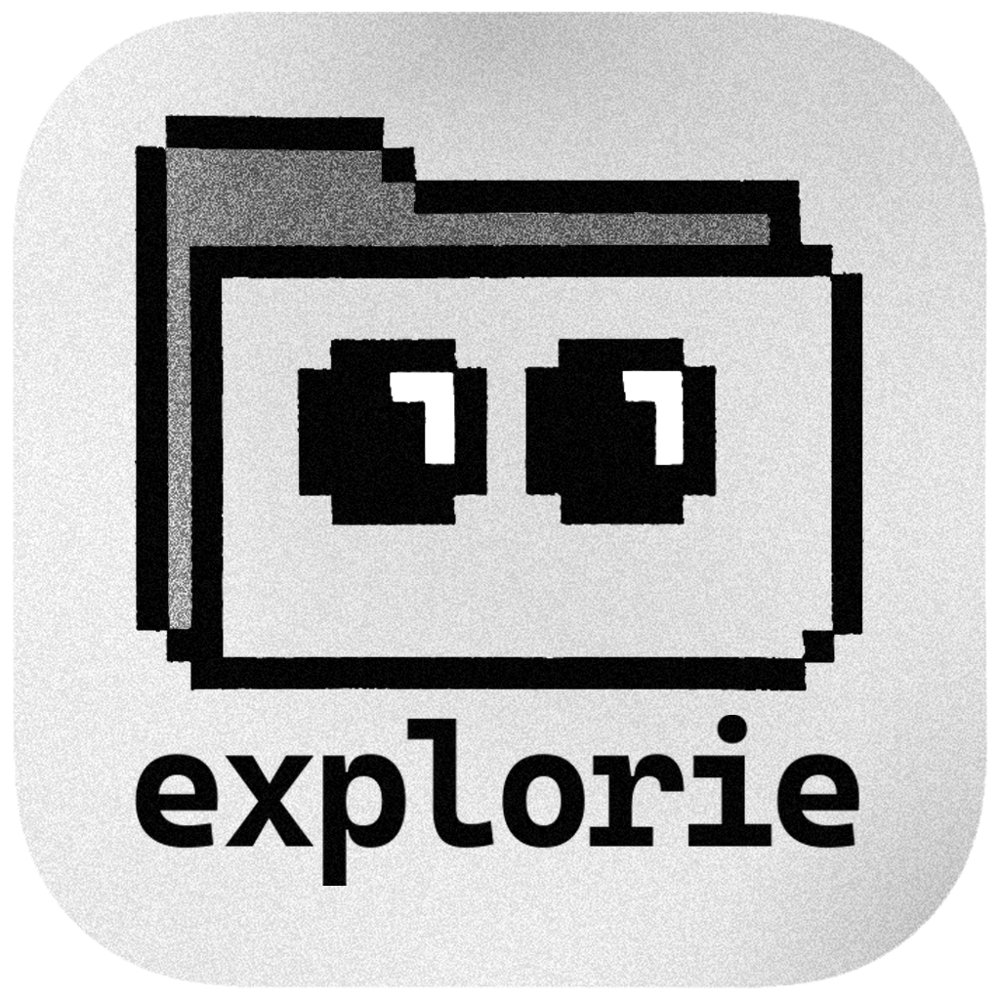

<p align="center">
  
</p>

# explorie

**Pre-release, local-first file manager for Windows. macOS is a build target, not yet a verified release target.**
_MIT-licensed, built to be understandable, extensible, and easy to customize._

---

## Overview

explorie is a Tauri + React file manager currently validated on **Windows**, with macOS support under active release validation. It uses plain JSON metadata and a themeable UI. The Rust core owns directory listing, file operations, size calculation, archives, and `.explorie.json` custom fields.

Key traits:

- No paywalls, no telemetry.
- Hackable front to back: CSS variables, `.explorie.json` metadata, Rust/TS helper crates.
- Fast-first: virtualization, cached folder sizes, and async previews.

Current features:

- **Multiple view modes:** List, Grid, and Finder-style Column views.
- **Tabbed browsing:** Open multiple directories in tabs (Ctrl/Cmd+T).
- **File previews:** Images, browser-playable videos, PDFs, code files with syntax highlighting, archive listings, and optional helper-generated previews.
- **Custom metadata:** Read/write `.explorie.json` for custom fields per folder.
- **Theming:** Dark/light/system themes, accent colors, local font stacks, UI scale, density, and more.
- **Drag & drop:** Move files between folders with visual feedback.
- **Settings panel:** Comprehensive appearance and behavior customization.
- **OS integration:** Native window controls and platform file opening.
- **Persistent Remote Drives:** Reconnect existing rclone remotes as native Windows drive letters or macOS volumes while explorie is running.

---

## Tech Stack

- **UI:** React 19, Vite 6, PNPM 9, Zustand 5, @tanstack/react-virtual, pixelarticons.
- **Desktop:** Tauri 2 (Rust 2024 edition), with filesystem and window integration.
- **CLI:** Rust binary sharing the core crate, with listing and FFmpeg command-preview modes.
- **Libs:** `crates/core` (filesystem, metadata, archives, and file operations) and `crates/ffmpeg-wrapper` (FFmpeg command builder).
- **Tests:** `cargo test`, Playwright e2e.

---

## System Requirements

### Required Dependencies

| Dependency  | Version               | Installation                                                           |
| ----------- | --------------------- | ---------------------------------------------------------------------- |
| **Node.js** | 20.x LTS              | [nodejs.org](https://nodejs.org) or `winget install OpenJS.NodeJS.LTS` |
| **pnpm**    | 9.x                   | `npm install -g pnpm` or `corepack enable`                             |
| **Rust**    | stable (2024 edition) | [rustup.rs](https://rustup.rs)                                         |

### Optional Dependencies

| Dependency      | Purpose                                        | Installation                                                                           |
| --------------- | ---------------------------------------------- | -------------------------------------------------------------------------------------- |
| **FFmpeg**      | Video thumbnails for non-browser video formats | Windows: `winget install ffmpeg`<br>macOS: `brew install ffmpeg`                       |
| **LibreOffice** | Office/OpenDocument preview conversion         | Windows: install from libreoffice.org<br>macOS: `brew install --cask libreoffice`      |
| **ImageMagick** | HEIC/TIFF/PSD preview conversion               | Windows: `winget install ImageMagick.ImageMagick`<br>macOS: `brew install imagemagick` |
| **cargo-watch** | Rust hot reload during dev                     | `cargo install cargo-watch`                                                            |

### Platform Notes

- **Windows:** Targets Windows 10/11. WebView2 runtime is usually pre-installed. When Remote Drives first need WinFsp, Explorie offers the bundled official installer with a native administrator prompt.
- **macOS:** Builds target macOS 13+ and require Xcode Command Line Tools. Remote Drives use an administrator-approved, bundle-contained mount helper. Do not treat macOS as release-ready until the signed package passes the real-machine checklist below.

---

## Monorepo Layout

```
apps/
  desktop/                 # Tauri runner (Rust backend in src-tauri/, React frontend in frontend/)
    frontend/
      src/
        components/        # React components (ListView, GridView, ColumnView, Preview, etc.)
        hooks/             # Custom React hooks (useTabs, useDragStart, useVirtualRows, etc.)
        utils/             # Utilities (fs, date, highlight, customColumns)
        workers/           # Web workers (sortWorker)
      src-tauri/           # Tauri Rust backend with file system commands
  cli/                     # CLI binary (Rust)
crates/
  core/                    # Rust business logic for listing, sizes, metadata
  ffmpeg-wrapper/          # FFmpeg command builder
tests/                     # Playwright specs
sample/                    # Demo data + .explorie.json examples
```

---

## Quickstart

```bash
git clone https://github.com/oshtz/explorie.git
cd explorie

pnpm install                             # install frontend deps
pnpm desktop:dev                         # run Tauri dev (frontend + Rust)
# or: pnpm desktop:web                   # web-only Vite dev

cargo run -p explorie-cli -- --help      # CLI help (listing and ffmpeg-preview)
```

---

## Commands & Scripts

### Development

| Command            | Description                                     |
| ------------------ | ----------------------------------------------- |
| `pnpm dev`         | Run Tauri dev (frontend + Rust)                 |
| `pnpm dev:watch`   | Dev with Rust hot reload (requires cargo-watch) |
| `pnpm desktop:web` | Web-only Vite dev server                        |
| `pnpm rust:watch`  | Watch Rust crates and run tests on change       |

### Building & Testing

| Command              | Description                                                            |
| -------------------- | ---------------------------------------------------------------------- |
| `pnpm desktop:build` | Build Tauri app for production                                         |
| `pnpm release:check` | Run local release-candidate checks and write `.release-checks` reports |
| `pnpm test`          | Run all tests (Rust + Playwright)                                      |
| `pnpm test:rust`     | Run Rust tests only                                                    |
| `pnpm test:unit`     | Run frontend unit tests (Vitest)                                       |
| `pnpm lint`          | Check formatting (cargo fmt + clippy)                                  |
| `pnpm typecheck`     | TypeScript type checking                                               |

For release-candidate verification, run `pnpm release:check` and use the release checklist below.

### CLI

```bash
cargo run -p explorie-cli -- --help
explorie [--with-sizes] [path]                           # List directory
explorie ffmpeg-preview in.mp4 out.webm --vf scale=1280:720  # Preview FFmpeg args
```

---

## Environment Variables

Copy `.env.example` to `.env.local` for local overrides. See `apps/desktop/frontend/.env.example` for frontend-specific variables.

| Variable            | Default                    | Description                                     |
| ------------------- | -------------------------- | ----------------------------------------------- |
| `RUST_LOG`          | `info,explorie_core=debug` | Rust logging level filter                       |
| `VITE_DEV_PORT`     | `5173`                     | Vite dev server port                            |
| `VITE_SOURCEMAP`    | `false`                    | Enable source maps in production                |
| `VITE_DROP_CONSOLE` | `true`                     | Strip console.log in production                 |
| `ANALYZE`           | `0`                        | Enable bundle analyzer (`ANALYZE=1 pnpm build`) |

---

## Screenshots

Add screenshots or a short demo GIF here before publishing the final public repository.

---

## Security and Filesystem Access

explorie is a local file manager. To browse and preview files, the desktop app requests broad read access to common user folders, mounted volumes, and Windows drive roots through Tauri's filesystem and asset protocols. Write access is intended for explicit file operations that the user initiates, such as rename, move, copy, delete, archive, extract, and metadata edits.

Review `apps/desktop/frontend/src-tauri/tauri.conf.json` before shipping forks or release artifacts. Treat custom builds and helper binaries with the same care as any other local file-management tool. Do not paste sensitive file contents, private paths, credentials, or exploit details into public issues.

Security vulnerabilities should be reported through GitHub private vulnerability reporting for the release repository. If private reporting is unavailable, open a minimal public issue asking for a private contact route without including exploit details.

explorie does not include telemetry. Diagnostics exports are local-only and are designed to redact path-like and sensitive values, but review any report before sharing it.

Remote Drives use the bundled, pinned rclone executable with the user's existing rclone configuration. Choose **Remote Drives → Configure** to open rclone's own interactive setup in a terminal; when it closes, Explorie refreshes the remote list and opens the Add Drive dialog. Explorie never stores provider credentials or OAuth tokens. Encrypted rclone configurations must be unlockable non-interactively through the user's existing rclone environment or password command. Mount processes run only while explorie is open; stable per-profile VFS caches allow interrupted uploads to resume.

---

## Known Limitations

- Public binary releases still need real-machine packaged-app QA before broad distribution; macOS is explicitly not release-ready until that proof exists.
- MP4, WebM, and M4V previews use the platform WebView video stack. Codec support depends on the OS/WebView; H.264/AAC MP4 is the expected happy path.
- MOV, AVI, MKV, WMV, FLV, M2TS, MPEG/MPG, and 3GP previews use FFmpeg to generate a still thumbnail when FFmpeg is installed.
- Office/OpenDocument previews require LibreOffice. HEIC/HEIF/TIFF/PSD previews require ImageMagick.
- macOS Finder/Quick Look integration and notarized DMG behavior should be checked on real machines for each release candidate.

---

## Release Checklist

Run:

```bash
cargo install cargo-audit --locked # once per machine
pnpm release:check
```

The command writes local evidence under `.release-checks/`, which is ignored by git. It requires a clean, version-aligned working tree; runs dependency audits, static checks, tests, Playwright on an isolated strict port, and a Tauri no-bundle build; then verifies the executable under the workspace `target/release` directory.

Automated updates are disabled. Releases are immutable and version-tag based. Bump the matching versions in the root package, desktop package, and desktop Cargo manifest, then push a new `v<version>` tag. That tag builds the candidate packages once and attaches them to a draft release. After those exact assets pass the real-machine checklist below, manually dispatch the release workflow from that tag with the Windows and macOS attestations enabled. The dispatch verifies and publishes the existing draft without rebuilding it. Existing releases and assets are never replaced; failures are fixed in a new version.

Protect `v*` tags and enable immutable releases in the GitHub repository settings before public distribution.

macOS releases require these signing secrets:

- macOS: base64-encoded P12 in `APPLE_CERTIFICATE`, plus `APPLE_CERTIFICATE_PASSWORD`, `APPLE_SIGNING_IDENTITY`, `APPLE_ID`, `APPLE_PASSWORD`, `APPLE_TEAM_ID`.

The v0.2.6 workflow publishes an explicitly named unsigned Windows x64 EVB portable executable, a signed/notarized macOS arm64 DMG, and platform SHA-256 manifests. Windows signing remains optional when `WINDOWS_CODESIGN_CERTIFICATE` and `WINDOWS_CODESIGN_PASSWORD` are later configured; until then, SmartScreen or antivirus warnings are expected. CI launch-smokes each package on its target runner; publication additionally requires explicit proof that both candidates passed disposable filesystem operations on real machines.

The v0.2.6 draft contains `explorie-0.2.6-windows-x64-portable-unsigned.exe`, `explorie-0.2.6-macos-arm64.dmg`, `SHA256SUMS-windows.txt`, and `SHA256SUMS-macos.txt`.

Before creating a new tag, manually verify:

- Launch the generated app on the target OS.
- Open folders in List, Grid, and Column views.
- Preview text, image, PDF/document, video, archive, and unsupported files.
- Exercise copy, move, rename, delete/trash, undo/redo, archive, and extract flows on disposable files.
- Reopen the app and confirm persisted settings.
- Confirm Windows and macOS packaged-app behavior on real machines.
- Remove or uninstall v0.1.0 before first running v0.2.6; the permanent `com.omershatz.explorie` identity intentionally starts a clean application lineage.
- Run the Windows portable executable and install the macOS package on real machines, confirm the Windows unsigned warning is expected, and verify macOS signing/notarization plus both SHA-256 manifests.

---

## Keyboard Shortcuts

| Shortcut     | Action                                               |
| ------------ | ---------------------------------------------------- |
| `Space`      | Open or close Quick Look for the selected file       |
| `Escape`     | Close dialogs, menus, Quick Look, or command palette |
| `Ctrl/Cmd+T` | New tab                                              |
| `Ctrl/Cmd+W` | Close tab                                            |
| `Ctrl/Cmd+P` | Command palette                                      |
| `Ctrl/Cmd+F` | Focus search                                         |
| `Ctrl/Cmd+,` | Settings                                             |
| `Arrow keys` | Navigate file views                                  |
| `Enter`      | Open selected item                                   |
| `F2`         | Rename selected item                                 |
| `Delete`     | Delete or trash selected item                        |

---

## Custom Metadata

explorie reads optional `.explorie.json` files from folders to attach custom fields to entries. A minimal file looks like:

```json
{
  "report.pdf": {
    "status": "review",
    "owner": "Alex",
    "tags": ["finance", "q2"]
  }
}
```

The metadata stays next to your files and is not synced by explorie itself.

---

## Third-Party Licenses and Attribution

explorie source code is MIT-licensed. The current dependency graph is primarily MIT, Apache-2.0, Apache-2.0/MIT dual-licensed, BSD-2-Clause, BSD-3-Clause, ISC, MIT-0, and compatible permissive licenses. Current frontend tooling scans also show `caniuse-lite` under CC-BY-4.0, `argparse` under Python-2.0, and `type-fest` under MIT or CC0-1.0.

Notable runtime and UI dependencies include React, Vite, Tauri, Zustand, TanStack Virtual, highlight.js, Pixelarticons, and Rust crates for filesystem, archive, tracing, Tauri, and platform integration. Explorie bundles rclone v1.74.4 under its MIT license and includes the license in packaged applications. Windows packages also include the official, unmodified WinFsp installer: **WinFsp - Windows File System Proxy, Copyright (C) Bill Zissimopoulos**, [source and license](https://github.com/winfsp/winfsp). Optional external helpers such as FFmpeg, LibreOffice, and ImageMagick are not bundled; their own licenses apply to user-installed copies.

App icons and sample assets in this repository are project assets unless replaced before release.

Before publishing a binary distribution, regenerate dependency license evidence from the final release repository and artifact build:

```bash
pnpm licenses list
cargo metadata --format-version 1
```

---

## License

MIT

---

Contributions, forks, and experiments are welcome.
